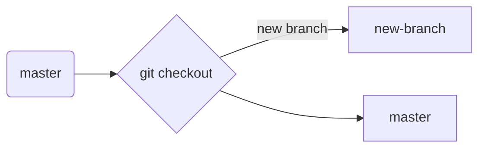

# Welcome to GIT 101

Lot of professionals I have had encounters with (even someone with almost 10-12 years of work experience) have had trouble using Git at some-point. 
but....... Git is soooooo scary and I just don't know what's going on and it's intimidating. I am scared of submitting my code accidentally to production or breaking some-one else's code.
Ok, I get it. initially it can be like that. but if you keep some basic things in mind and follow a simple procedure it becomes second nature for you to get used to Git workflow.

## Install git and create a GitHub account

Let's make one thing cleared up first. GitHub and Git are two _different_ things. 
**Git** is an open-source version control system.
**GitHub**  is a hosting service for Git repositories. also provides bunch of other features on top of it. like private repositories, access controls for the team, GUI to display timelines for the repositories etc.

The first two things you'll want to do are install git and create a free GitHub account.

Follow the instructions  [here](https://git-scm.com/book/en/v2/Getting-Started-Installing-Git) to install git (if it's not already installed). Note that for this tutorial we will be using git on the command line only. While there are some great git GUIs (graphical user interfaces), I think it's easier to learn git using git-specific commands first and then to try out a git GUI once you're more comfortable with the command.

Once you've done that, create a GitHub account [here](https://github.com/join). (Accounts are free for public repositories, but there's a charge for private repositories.)


## Create a local git repository

To use git we'll be using the terminal. 
When creating a new project on your local machine using git, you'll first create a new **[repository](https://git-scm.com/book/en/v2/Git-Basics-Getting-a-Git-Repository)** (or often, '**repo**', for short).

To begin, open up a terminal and move to where you want to place the project on your local machine using the  `cd`  (change directory) command. For example, if you have a 'workspace' folder on your desktop, you'd do something like:
```
asav @ / $ cd ~/workspace
asav @ ~/workspace $ mkdir myproject
asav @ ~/workspace/myproject $ cd myproject/
```

now, initialize a git repository in the root of the folder, run the **[git init](http://git-scm.com/docs/git-init)** command:
```shell
asav @ ~/workspace/myproject $ git init
Initialized empty Git repository in /Users/asav/workspace/myproject/.git/
```
_**Congratulations**_ you have created your first Git repo.

## Add a new file to the repo

Now, let's add a new file to the repo.

Once you've added or modified files in a folder containing a git repo, git will notice that changes have been made inside the repo. But, git won't officially keep track of the file (that is, put it in a commit - we'll talk more about commits next) unless you explicitly tell it to.
```shell
asav @ ~/workspace/myproject $ touch test_file.txt
asav @ ~/workspace/myproject $ ls
test_file.txt
```

After creating the new file, you can use the [**git status**](http://git-scm.com/docs/git-status) command to see which files git knows exist.

```shell
asav @ ~/workspace/myproject $ git status
On branch master

Initial commit

Untracked files:
  (use "git add <file>..." to include in what will be committed)

	test_file.txt

nothing added to commit but untracked files present (use "git add" to track)
```

What this means is, hey I noticed you have created a new file. but I am not going to do anything till you specifically ask me to track the new file you have created. 
so now, how do we tell git to track the new file we just created...???

#### An interlude: The staging environment, the commit, and you

One of the most confusing parts when you're first learning git is the concept of the staging environment and how it relates to a commit.

A **[commit](http://git-scm.com/docs/git-commit)** is a record of what files you have changed since the last time you made a commit. Essentially, you make changes to your repo (for example, adding a file or modifying one) and then tell git to put those files into a commit.

Commits make up the essence of your project and allow you to go back to that particular state of a project at any point. Each commit has their own _MD5 Hash_ as an index. so each commit will always be unique.

So, how do you tell git which files to put into a commit? This is where the  [**staging environment** or **index**](https://git-scm.com/book/en/v2/Getting-Started-Git-Basics)  come in. As seen in Step 2, when you make changes to your repo, git notices that a file has changed but won't do anything with it (like adding it in a commit).

To add a file to a commit, you first need to add it to the staging environment. To do this, you can use the **[git add](http://git-scm.com/docs/git-add)  <filename>** command (see Step 3 below).

Once you've used the git add command to add all the files you want to the staging environment, you can then tell git to package them into a commit using the  [**git commit**](http://git-scm.com/docs/git-commit)command.

Note: The staging environment, also called 'staging', but you will hear people interchanging 'staging' with 'index'.

## Add a file to the staging

Add a file to the staging environment using the  **git add**  command.

If you rerun the git status command, you'll see that git has added the file to the staging environment (notice the "Changes to be committed" line).

```shell 
asav @ ~/workspace/myproject $ git status
On branch master

Initial commit

Changes to be committed:
  (use "git rm --cached <file>..." to unstage)

	new file:   test_file.txt
```

Again, the file has **not** yet been added to a commit, we just told git to add this file to a commit.

## Create a commit

It's time to create your first commit!

Run the command  `git commit -m "Your message about the commit"`

```shell
asav @ ~/workspace/myproject $ git commit -m "This is my first commit!"
[master (root-commit) b345d9a] This is my first commit!
 1 file changed, 1 insertion(+)
 create mode 100644 test_text.txt
 ```

### Please...please....please


make your commit messages as relevant as it can be. maybe it's a new feature, maybe it's a bug fix, maybe it's just fixing a typo. Don't put a message like "asdfadsf" or "new file" or "commit message".  it gets really messy to go through those commits and figure out what was changed in which commit.

## Create a new branch

Now let's up this game a bit.

Say you want to make a new feature but are worried about making changes to the main project while developing the feature. This is where  **[git branches](https://git-scm.com/book/en/v1/Git-Branching-What-a-Branch-Is)** come in.

Branches allow you to move back and forth between 'states' of a project. For instance, if you want to add a new page to your website you can create a new branch just for that page without affecting the main part of the project. Once you're done with the page, you can [**merge**](http://git-scm.com/docs/git-merge)  your changes from your branch into the master branch. When you create a new branch, Git keeps track of which commit your branch 'branched' off of, so it knows the history behind all the files. _Git knows all_ 

Let's say you are on the master branch and want to create a new branch to develop your web page. Here's what you'll do: Run **[`git checkout -b <my branch name>`](http://git-scm.com/docs/git-checkout)**. This command will automatically create a new branch and then 'check you out' on it, meaning git will move you to that branch, off of the master branch.



After running the above command, you can use the  **[`git branch`](http://git-scm.com/docs/git-branch)**  command to confirm that your branch was created:

```shell
asav @ ~/workspace/myproject $ git branch
  master
* new-branch
```
Asterisk indicates your current branch.
From now on, any work you do in master branch is totally independent of the new branch you created.

## Create a new repository on GitHub

If you only want to keep track of your code locally, you don't need to use GitHub. But if you want to work with a team, you can use GitHub to collaboratively modify the project's code.

To create a new repo on GitHub, log in and go to the GitHub home page. You should see a green '+ New repository' button:


Provide a name and a brief description for your repo:


press the 'Create repository' button to make your new repo.

Now, we'll push our local code to the repo.
Let's get back to our _lovely_ command line:
```shell  
asav @ ~/workspace/myproject $ git remote add origin https://github.com/asavpatel92/test_repo.git
asav @ ~/workspace/myproject $ git push -u origin master
Counting objects: 3, done.
Writing objects: 100% (3/3), 263 bytes | 0 bytes/s, done.
Total 3 (delta 0), reused 0 (delta 0)
To https://github.com/asavpatel92/test_repo.git
 * [new branch]      master -> master
Branch master set up to track remote branch master from origin.
```

## Push a branch to GitHub

Now we'll  **push**  the commit in your branch to your new GitHub repo. This allows other people to see the changes you've made. If they're approved by the repository's owner, the changes can then be merged into the master branch.

To push changes onto a new branch on GitHub, you'll want to run **[git push](http://git-scm.com/docs/git-push)  origin yourbranchname**.  GitHub will automatically create the branch for you on the remote repository: 

```shell
asav @ ~/workspace/myproject $ git push origin my-new-branch
Counting objects: 3, done.
Delta compression using up to 8 threads.
Compressing objects: 100% (2/2), done.
Writing objects: 100% (3/3), 313 bytes | 0 bytes/s, done.
Total 3 (delta 0), reused 0 (delta 0)
To https://github.com/asavpatel92/test_repo.git
 * [new branch]      new-branch -> new-branch
 ```
You might be wondering what that "origin" word means in the command above. What happens is that when you clone a remote repository to your local machine, git creates an **alias** for you. In nearly all cases this alias is called "[**origin**](https://git-scm.com/book/en/v2/Git-Basics-Working-with-Remotes)." It's essentially shorthand for the remote repository's URL. So, to push your changes to the remote repository :
**`git push origin yourbranchname`**

Now you can see new branch added to your repo.


## Create a Pull Request (PR)

A pull request (or PR) is a way to alert a repo's owners that you want to make some changes to their code. It allows them to review the code and make sure it looks good before putting your changes on the master branch.

This is what the PR page looks like before you've submitted it:


when you submit it a pull request:


You might see a big green button at the bottom that says 'Merge pull request'. Clicking this means you'll merge your changes into the master branch.

Note that this button won't always be green. In some cases it'll be grey, which means you're faced with a  **merge conflict**. This is when there is a change in one file that conflicts with a change in another file and git can't figure out which version to use. You'll have to manually go in and tell git which version to use.

Sometimes you'll be a co-owner or the sole owner of a repo, in which case you may not need to create a PR to merge your changes. However, it's still a good idea to make one so you can keep a more complete history of your updates and to make sure you always create a new branch when making changes.

## Merge a PR

Usually you ask someone to review your changes and merge the PR. Clickingo on that Green Button will merge your changes into the master branch.


When you're done, I recommend deleting your branch (too many branches can become messy), so hit that grey 'Delete branch' button as well.

## Get changes on GitHub back to your computer

Right now, the repo on GitHub looks a little different than what you have on your local machine. For example, the commit you made in your branch and merged into the master branch doesn't exist in the master branch on your local machine.

In order to get the most recent changes that you or others have merged on GitHub, use the  **git pull origin master** command (when working on the master branch).

```shell
asav @ ~/workspace/myproject $ git pull origin master
remote: Counting objects: 1, done.
remote: Total 1 (delta 0), reused 0 (delta 0), pack-reused 0
Unpacking objects: 100% (1/1), done.
From https://github.com/asavpatel92/test_repo
 * branch            master     -> FETCH_HEAD
   b345d9a..5381b7c  master     -> origin/master
Merge made by the 'recursive' strategy.
 mnelson.txt | 1 +
 1 file changed, 1 insertion(+)
 ```
you can always use **git log** to check if you received all the changes back from Github.
you will also need to frequently change branches while working. use **git checkout _branchname_**  to switch to a different branch.

### Time to swim with the sharks or may be the octopus.!
I hope this would be at least _git_  you started on your journey to use Git efficiently. ;-)
